<div align="center">

<picture>
  <source media="(prefers-color-scheme: dark)" srcset="./assets/hero-dark.svg">
  <source media="(prefers-color-scheme: light)" srcset="./assets/hero-light.svg">
  
</picture>

<br>

[](https://rishabhportflio.com/)
[](https://www.linkedin.com/in/rishabhjain2824/)
[](mailto:rishabh2824@gmail.com)
[](https://rishabhportflio.com/)

</div>

---

### `$ whoami`

I'm **Rishabh** — a CS master's student at **UW–Madison** who spends most of his time turning LLMs into things people can actually *use*: multi-agent simulations for classrooms, research tooling for PhD labs, internal platforms for small teams.

Two things I care about:

- **Shipped > built.** Every project below is running in production with real users on it — not a demo in a repo.
- **Full-stack, end to end.** I own the thing from the Postgres schema to the animation curve.

📍 Madison, WI &nbsp;·&nbsp; 🎓 MS CS, May 2027 &nbsp;·&nbsp; 🔎 **Open to New Grad SWE roles, 2027**

---

### `$ ls -la ./projects`

<table>
<tr>
<td width="50%" valign="top">

#### 🎓 Wisconsin Case Lab
**Multi-agent business-case simulator used by real classes.**

Students interview 8+ AI stakeholder personas, unlock case files, and submit recommendations that an LLM grades against a rubric. Handles **70+ concurrent students** across **12+ case studies**, with an admin panel for per-case ownership, collaborators, and rosters.

`Svelte` `Convex` `FastAPI` `Neon Postgres` `Tailwind`

[**Live →**](https://wisconsincaselab.com) &nbsp;·&nbsp; [**Code →**](https://github.com/rishabh2824/CaseLab)

</td>
<td width="50%" valign="top">

#### 🗂️ Iris — Project Management for DataCEVA
**Internal ticketing + analytics platform.**

Kanban ticket tracking with split employee/client workflows, Slack API integration that tags tickets to workspaces, and AI-generated status nudges. The analytics dashboard tracks time against targets — **+35% billing accuracy, +19% team productivity**.

`FastAPI` `PostgreSQL` `React` `Tailwind` `DigitalOcean`

<sub>Built for a client — repository is private.</sub>

</td>
</tr>
<tr>
<td width="50%" valign="top">

#### 🧪 LLM Survey Platform — Wisconsin School of Business
**Research infrastructure for 30+ PhD researchers.**

A Qualtrics-integrated agent that turns natural-language prompts into geometric actions and scores them live for **100+ study participants**, plus a platform for generating demographic-conditioned LLM survey responses — **cutting questionnaire testing time and cost by up to 60%**.

`Python` `LLM APIs` `JavaScript` `Qualtrics`

</td>
<td width="50%" valign="top">

#### 🖥️ [Portfolio — an immersive 3D desk](https://rishabhportflio.com/)
**My site is the project.**

A scroll-driven WebGL workspace built with React Three Fiber and GSAP — keyboard-navigable, animation-tuned, and the reason the banner above looks like a desk.

`React` `Three.js / R3F` `GSAP` `TypeScript` `Vite`

</td>
</tr>
</table>

<div align="center">

**Also shipped:** [ai-horizon.io](https://ai-horizon.io) — 50+ page company site, 20+ custom animations, admin CMS, and an AI support chatbot that lifted engagement **23%**

</div>

---

### `$ cat stack.json`

<div align="center">

**Languages**


**Frontend**


**Backend & Data**


**AI / ML**


**Infra & Tools**


</div>

---

### `$ git log --author="rishabh" --oneline`

```text
2025-09 → now   Research Assistant · Wisconsin School of Business
                LLM agents + research tooling for 30+ PhD researchers
2025-05 → 08    Frontend Developer Intern · ai-horizon.io
                50+ page product site, admin CMS, AI chatbot (+23% engagement)
2025-01 → 05    Teaching Assistant · Wisconsin School of Business
                End-to-end ML lifecycle, 60+ students, weekly office hours
2024-05 → 08    Machine Learning Intern · Reliance Jio
                Battery-backup forecasting at 91% accuracy (−15% downtime)
2023-05 → 08    Data & Networks Intern · NTT DATA
                ELK stack for 300+ devices (+20% network throughput)
```

---

### `$ watch -n1 github`

<div align="center">

<picture>
  <source media="(prefers-color-scheme: dark)" srcset="https://raw.githubusercontent.com/rishabh2824/rishabh2824/output/snake-dark.svg">
  <source media="(prefers-color-scheme: light)" srcset="https://raw.githubusercontent.com/rishabh2824/rishabh2824/output/snake.svg">
  
</picture>

</div>

---

<div align="center">

### `$ ./contact.sh`

**Building something interesting? I'd like to hear about it.**

[](mailto:rishabh2824@gmail.com)
[](https://www.linkedin.com/in/rishabhjain2824/)

<sub>Profile views  &nbsp;·&nbsp; banner hand-drawn in SVG, animations and all</sub>

</div>
